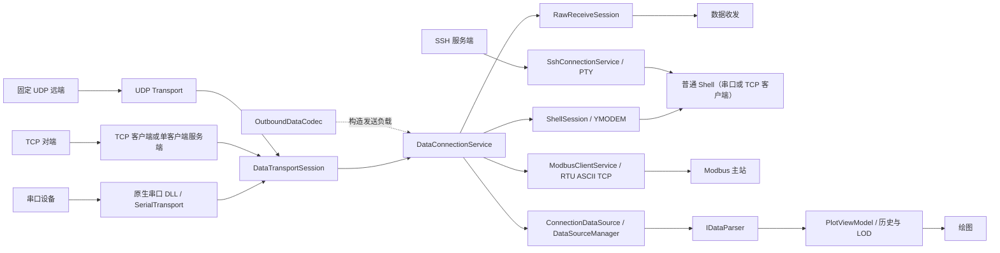
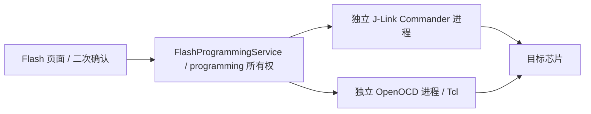
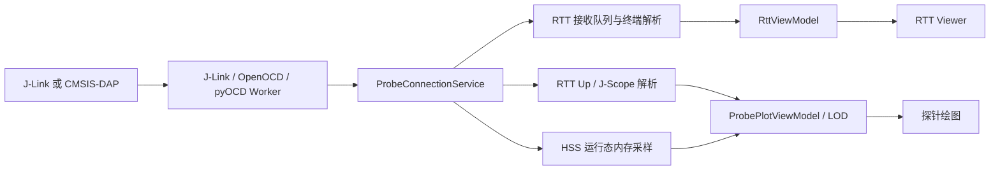

# SerialTools 开发指南

本文只记录可执行的开发、验证、构建和发布流程。用户说明见 [README.md](README.md)，长期架构与安全约束见 [docs/CONTEXT.md](docs/CONTEXT.md)，自动化工具规则见 [AGENTS.md](AGENTS.md)；若内容冲突，以后两者为准。

## 1. 开发环境

| 依赖 | 要求 |
| --- | --- |
| Windows | Windows 10/11 x64 |
| Flutter | Stable，Dart `>=3.7.2` |
| Visual Studio 2022 | “使用 C++ 的桌面开发”工作负载 |
| PowerShell | PowerShell 7，命令 `pwsh` |
| Python | 3.7+ |
| Git | 当前稳定版 |

可选工具：

- `pyserial`：串口模拟脚本。
- 7-Zip：发布压缩；缺失时脚本回退到 Python ZIP。
- com0com 或 Virtual Serial Port Driver：创建虚拟串口对。
- Windows SDK Debugging Tools：分析 minidump。

```powershell
python -m pip install pyserial
flutter config --enable-windows-desktop
flutter doctor
flutter pub get
```

所有代码和文档读写使用 PowerShell 7，不要依据 Windows PowerShell 5.1 的中文输出判断文件内容。

## 2. 运行与构建

Debug 运行：

```powershell
flutter run -d windows
```

直接构建未打包的 Release：

```powershell
$buildTime = (Get-Date).ToUniversalTime().ToString("yyyy-MM-ddTHH:mm:ssZ")
flutter build windows --release "--dart-define=BUILD_TIME=$buildTime"
```

输出目录：

```text
build/windows/x64/runner/Release/
```

`flutter run` 和直接 `flutter build` 不等同于发布打包；内置运行时、许可证、更新资产、符号归档和便携 ZIP 由发布脚本处理。

## 3. 目录与职责

```text
lib/
├── core/             # 日志、本地化和通用工具
├── data/             # 模型、解析器、协议、数据源和 LOD
├── services/         # 串口、探针、设置、更新和系统资源
├── viewmodels/       # 页面状态与业务流程
└── views/            # 页面、弹窗、Painter、手势和组件

assets/runtime/       # 随应用发布的 Worker 等运行资产
windows/              # Runner、原生串口 DLL、更新器
test/                 # 单元测试和 Widget 测试
integration_test/     # Windows Profile 性能场景
test_tools/           # 模拟设备、数据生成和性能基准
tools/                # 构建、更新和转储分析脚本
docs/                 # 长期上下文、报告和图片
```

修改模块边界、连接生命周期、绘图数据链路或探针后端前，先阅读 [docs/CONTEXT.md](docs/CONTEXT.md) 中对应的长期架构与安全约束。

### 3.1 连接数据流向

串口、TCP 和 UDP 最终汇入统一的数据连接服务，再按当前活动页面分流。箭头表示接收方向；发送沿相同链路反向返回设备或网络对端。



页面入口按连接类型限制：串口可进入数据收发、Shell、绘图和Modbus；TCP客户端可进入数据收发、Shell、绘图和Modbus；UDP可进入数据收发和绘图；TCP服务端只进入数据收发。SSH使用独立加密会话，但仍与数据连接和探针连接共享全局连接所有权。

Flash编程使用单独的高权限流向，不经过探针监控服务：



`FlashProgrammingService`存在期间只能停留在Flash页面；RTT Viewer、RTT绘图和HSS仍只使用独立的非侵入式探针会话。

随机源不建立外部连接，只模拟绘图接收数据：


探针连接由独立服务管理，RTT Viewer 与探针绘图共享空闲连接，但数据活动分别进入各自链路：



## 4. 代码检查与测试

提交前至少执行：

```powershell
dart format lib test integration_test
flutter analyze
flutter test
```

不要在文档中维护容易过期的“当前通过数量”。交付时记录本次实际执行结果即可。

定向运行单个测试：

```powershell
flutter test test/viewmodels/plot_viewmodel_test.dart
flutter test test/services/app_settings_test.dart
flutter test test/views/probe_plot_page_test.dart
```

绘图重建隔离测试：

```powershell
flutter test test/views/plot_page_rebuild_test.dart --dart-define=PLOT_PERF_METRICS=true
```

`analysis_options.yaml` 启用 `unawaited_futures`、`close_sinks` 和 `cancel_subscriptions`。后台 Future 使用 `unawaited()`；订阅、Controller 和 sink 必须由创建者在 stop/dispose 中释放。

测试优先验证行为、状态流转、数据格式和关键交互，不锁定纯颜色、固定像素或单个图标。

## 5. 测试工具

| 工具 | 用途 |
| --- | --- |
| `zobow_device.py` | 模拟 Zobow 配置和 4/8 通道数据 |
| `justfloat_device.py` | 模拟 r 命令和 JustFloat 数据 |
| `shell_device.py` | 模拟 Shell、ANSI 和 YMODEM 对端 |
| `text_sender.py` | 验证多编码文本、换行和回显 |
| `generate_plot_bin.py` | 生成大规模绘图 BIN 测试数据 |
| `zobow_c_profile_import.dart` | 独立验证 Zobow C 配置导入 |
| `test_pyocd_worker.py` | 验证 pyOCD Worker 协议、数据访问和权限限制 |
| `test_updater.py` | 验证原生 Windows 更新、用户文件保留和失败回滚 |
| `run_plot_benchmark.ps1` | 运行 Windows Profile 绘图性能基准 |
| `run_p1_stability_soak.ps1` | 运行 P1 稳定性长时测试 |

具体参数、虚拟串口流程和运行命令统一维护在 [test_tools/README.md](test_tools/README.md)，本文不重复。新增或修改工具时必须同步更新该文档。

## 6. `tools/` 工具

| 工具 | 用途 |
| --- | --- |
| `analyze_crash_dump.ps1` | 检查 Windows minidump、日志和 PDB 是否完整匹配，调用 CDB 生成中文分析报告 |
| `build_release.py` | 清理旧产物，执行检查、测试和全新 Windows Release 构建，打包运行时、许可证、更新资产、便携包和符号包 |
| `generate_update_assets.py` | 从 Release bundle 生成便携 ZIP、`app-files.json` 和带大小/SHA-256 的更新清单 |
| `prepare_openocd_runtime.py` | 下载并校验固定版本的 xPack OpenOCD，将最小运行时、脚本和许可证打包为单一 ZIP 和校验清单 |

具体参数和操作流程见 [tools/README.md](tools/README.md)，本文不重复。新增或修改工具时必须同步更新该文档。

## 7. 发布打包

完整流程：

```powershell
python tools/build_release.py
```

可用参数以 `python tools/build_release.py --help` 为准：

```powershell
python tools/build_release.py --skip-analyze
python tools/build_release.py --skip-test
python tools/build_release.py --no-zip
python tools/build_release.py --version 1.0.7-beta.5
```

脚本必须重新构建，不提供复用旧 Windows 产物的 `--skip-build`。输出位于 `build/releases/`，流程包括：

- 清理旧发布目录和 Windows 构建树。
- 执行检查、测试和 Windows Release 构建。
- 复制应用、原生 DLL、VC++ 运行时，并生成内置 OpenOCD 压缩运行时和校验清单。
- 收集第三方许可证并生成 `THIRD_PARTY_NOTICES`。
- 生成更新资产和便携 ZIP。
- 排除 `.lib`、`.exp`、`.pdb` 等中间文件；PDB 单独归档为匹配版本的符号包。

手动生成更新资产：

```powershell
python tools/generate_update_assets.py `
  --bundle build/windows/x64/runner/Release `
  --tag v1.0.7-beta.5 `
  --output dist
```

每个 Release 至少包含：

- `vscope_serial-windows-vX.Y.Z.zip`
- `update-manifest-vX.Y.Z.json`

## 8. CI 与版本发布

`.github/workflows/windows-release.yml`：

- PR 到 `main`：analyze、完整测试、Windows Release 构建。
- 手动触发：执行测试与构建。
- 推送 `v*` tag：创建 GitHub Release，并同步附件到 Gitee。
- 普通 push 到 `main`：不发布。

版本规则：

- `pubspec.yaml`：`X.Y.Z` 或 `X.Y.Z-beta.N`。
- Git tag：在相同版本前加 `v`。
- tag 去掉 `v` 后必须与 `pubspec.yaml` 一致。
- `CHANGELOG.md` 必须存在同名版本段落；Beta Release 标记为 prerelease。

示例：

```powershell
git tag v1.0.7-beta.5
git push origin dev
git push origin v1.0.7-beta.5
```

发布前检查：

1. 工作树、版本号和 Changelog。
2. `flutter analyze`、`flutter test` 和 Release 构建。
3. 发布目录来自本次全新构建。
4. ZIP、更新清单、许可证和符号包完整。
5. 更新保留 `settings/`、`config/`、`logs/`、`exports/` 和未知用户文件。

## 9. Git 与文档

- 开发分支 `dev`，发布分支 `main`。
- 提交信息使用中文，建议遵循 Conventional Commits。
- 不覆盖或回滚他人修改；提交前检查 `git status`，只暂存任务相关文件。
- `CHANGELOG.md` 只写用户可感知的最终变化；发布内容提交前让用户核对。
- force push 前明确确认目标分支或 tag。
- 新的长期架构/安全决策写入 `docs/CONTEXT.md`；开发命令写入本文；用户操作写入 README；专项证据写入 `docs/reports/`。
