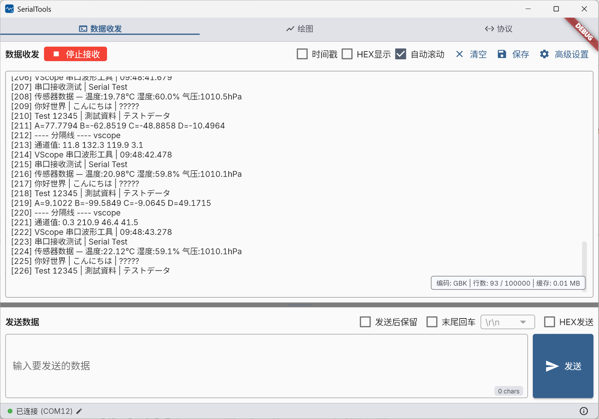
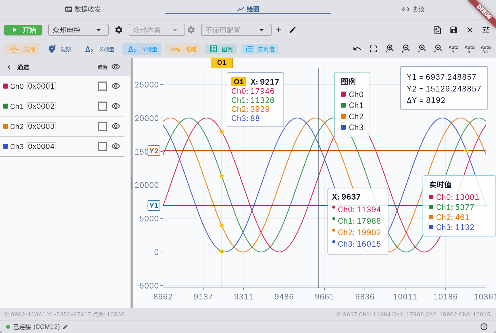

# SerialTools

SerialTools 是一款面向 Windows 的串口数据收发与波形分析工具，支持多种串口协议、实时绘图、Shell 终端、YMODEM 文件传输和 RTT 查看。




## 主要功能

- 串口枚举、连接、参数配置和连接状态显示。
- 文本/HEX 原始数据收发，支持时间戳、自动行尾、回显、多种文本编码和多条发送配置。
- FireWater、固定帧、Zobow、JustFloat 接收协议，以及独立的发送协议配置。
- 最多 16 个普通通道和 4 个数学通道实时绘图。
- 波形缩放、平移、框选、跟随、观察、X/Y 测量和区间统计。
- CSV、BIN 和旧版 `.dat` 数据导入，文本、BIN 和绘图数据导出。
- 可选的独立 Shell 页面，支持 ANSI 终端、命令行/逐键输入和 YMODEM 文件发送/接收。
- 可选的独立 RTT Viewer，支持 J-Link、CMSIS-DAP 和 RTT Up 0 文本/HEX 查看。
- 稳定版/Beta 更新通道、自动更新校验和本地版本回退。

## 下载与启动

1. 从 [GitHub Releases](https://github.com/ZhiJuan0724/vscope_serial/releases) 或 [Gitee Releases](https://gitee.com/ZhiJuan0724/vscope_serial/releases) 下载 Windows ZIP。
2. 将压缩包完整解压到可写目录，不要直接在压缩包内运行。
3. 启动 `vscope_serial.exe`。

支持 Windows 10/11 x64。应用设置、日志、导出文件和更新缓存默认保存在程序所在目录，因此不建议安装到无写入权限的位置。

## 快速使用

### 连接串口

1. 点击窗口底部的串口状态区域。
2. 选择端口、波特率、数据位、停止位和校验位。
3. 点击“连接”。
4. 如需查看设备名称，开启“显示详细信息”后手动刷新端口列表。

设备名称读取默认关闭，避免部分 USB 串口驱动导致刷新耗时过长。
刷新后若上次选择的端口已经不存在，连接窗口会明确标记该端口不可用，避免把历史选择误认为当前可连接设备。
连接、健康检查、异常清理、自动重连、主动断开和应用退出按单一队列有序执行；连接过程中也可以取消，退出应用会等待当前串口生命周期安全收敛。

### 原始数据收发

1. 打开“数据收发”页。
2. 按设备选择文本或 HEX 显示方式。
3. 设置文本编码、时间戳、自动滚动和行尾。
4. 输入内容并发送；停止接收后可将完整原始数据导出为文本或 BIN。

文本发送和接收共用同一编码设置。显示行数只影响界面缓存，不影响容量范围内的完整原始数据导出。

原始字节记录固定上限为 512 MiB：达到 80% 时持续预警，达到上限时只保留最后数据块中可容纳的前缀并停止原始接收，已有数据仍可导出，串口保持连接。YMODEM 文件接收不会被原始追踪上限截断，但达到上限后不再把传输字节追加到原始记录。清空原始数据后可重新接收。

发送区的“扩展”可打开多条发送面板。每个配置可保存多个文本或 HEX 条目，并支持单条发送、执行一轮、持续循环、排序以及 JSON 导入导出。

### 实时绘图

1. 打开“绘图”页并选择接收协议。
2. 按需选择发送协议和地址配置。
3. 设置通道名称、地址、数据类型和显示状态。
4. 点击“开始绘图”。
5. 使用工具栏或鼠标完成缩放、平移、测量、观察和数据导入导出。

绘图过程中会锁定协议、配置和数据导入导出，停止绘图后即可修改。数据收发、Shell 或绘图任一页面开始实际接收后，也会锁定当前页面；停止或断开串口后才能切换页面。串口和 RTT 互斥：RTT 已连接时不能使用串口页面，串口已连接时不能连接 RTT。

开启“保持绘图”后，停止再开始可在同一接收协议且通道数一致的旧数据流后继续追加；切换接收协议、自动识别通道数变化或导入数据后会清空旧历史，不支持跨协议或导入历史续接。

最大可见范围可设置为 1M～10M 点，默认 1M；超过 250k 点的视口自动使用 LOD 绘制，缩放到局部后会在视口前后预取最多 250k 精确点。定位条连续拖动时先显示有界 LOD 预览，停顿或松手后再加载精确块。10M 表示可导航、可导出的精确历史范围，不表示同时创建 10M 个界面对象。绘图历史内存上限可设置为 1～8 GiB，默认 2 GiB；达到 80% 时预警，达到上限时自动停止绘图。应用进程 RSS 紧急保护线统计 Flutter 引擎和全部功能的进程占用，仅在绘图追加数据时检查，达到后停止绘图并保留已有历史和导出能力，串口不会因此断开。建议在至少 16 GB RAM 的 Windows 机器上使用大范围绘图。



## 协议说明

| 协议 | 数据格式 | 适用场景 |
| --- | --- | --- |
| FireWater | 逗号分隔的 ASCII 数值文本 | 通用文本波形输出 |
| 固定帧 | 可配置帧头、帧尾、通道类型、大小端和 CRC | 自定义二进制协议 |
| Zobow | 4/8 通道固定帧，CRC16/MODBUS | 众邦设备 |
| JustFloat | 小端 `float32` 数组 + `00 00 80 7F` 帧尾 | VOFA JustFloat 兼容设备 |
| r 协议 | `r 地址1 地址2 ...` 文本命令 | 向设备发送通道读取地址 |

固定帧、Zobow 和 r 协议的详细选项可在对应协议设置或通道设置中配置。地址配置支持 JSON/CSV 导入和导出。

## 绘图操作

- 鼠标滚轮：缩放 X 轴。
- `Shift + 滚轮`：缩放 Y 轴。
- 鼠标拖动：平移当前视口。
- `Shift + 左键拖动`：根据起始方向锁定并缩放 X 或 Y 轴。
- 通道右键菜单：高级设置、偏置绑定和数学通道操作。
- 绘图空白区域右键：添加数学通道或重置通道。
- 工具栏：观察、跟随、图例、实时值、X/Y 测量和区间统计。

绘图设置中可调整背景、网格、刷新率、最大可见范围、浮窗透明度和交互行为。大范围绘图质量提供“性能优先”“均衡”和“质量优先”三档；更高档位会使用更精细的 LOD，同时增加绘图性能开销。原始页和绘图页状态栏会显示当前容量、百分比和上限；容量停止原因需要通过清空对应数据解除。底部状态栏可显示实际渲染 FPS。

## Shell 与 YMODEM

Shell 是独立页面，入口默认隐藏，可在应用高级设置中开启。Shell 使用独立的编码、命令行行尾、本地回显和外观设置，不继承数据收发页的文本/HEX 选项。Shell 支持：

- 命令行发送和逐键发送。
- ANSI 颜色与终端控制序列。
- UTF-8、GBK、BIG5、Shift_JIS、EUC-KR 等多字节编码的流式接收。
- `Ctrl+C` 向设备发送 ETX。
- `Ctrl+Shift+C` 或右键复制终端文本。
- 命令历史、终端文本导出和可配置滚动历史。
- YMODEM 文件发送与接收。

接收到的 YMODEM 文件默认保存到 `<程序目录>/exports/ymodem/`。

## RTT Viewer

RTT Viewer 默认隐藏，可在应用高级设置的“页面”分类中开启。页面支持 SEGGER 虚拟终端 0～15、All Terminals 汇总、RTT Down 0 双向发送、暂停显示、时间戳、文本/HEX、自动滚动、清空和导出。

开启 RTT Viewer 后还会显示最右侧“探针绘图”页面。OpenOCD 和外置 pyOCD 后端支持运行态只读内存采样 HSS，以及从 `_SEGGER_RTT` 控制块枚举 Up 通道；名称符合 `JScope_<FORMAT>`（例如 `JScope_i4u4`）的通道会自动识别数据格式，普通名称可手动填写格式。程序文件支持 ELF 格式的 `.elf`、`.axf` 和 `.out`，由应用本地解析 ELF 文件头和数据符号，不依赖探针后端。

RTT 控制块可选择 `Auto`、指定地址或指定范围。Auto 会扫描目标定义的 RAM；若当前后端版本无法自动定位，可改为输入精确地址，或限定一段 RAM 搜索范围。

- 探针连接窗口可选择 `自动`、外部 J-Link、外置 OpenOCD、内置 OpenOCD 或外置 pyOCD。CMSIS-DAP 自动模式依次选择外置 OpenOCD、内置 OpenOCD、外置 pyOCD；选定后连接失败不会静默切换。
- Windows 发布包内置固定版本的轻量 OpenOCD 运行时、完整 scripts 和许可证；高级设置分别显示内置、外置 OpenOCD 的检测版本，外置路径可手动覆盖。OpenOCD 需要填写接口和目标 Tcl 配置，并使用指定地址或指定范围定位 RTT 控制块。
- 外置 pyOCD 需要在高级设置中指定已安装 pyOCD `0.45.x` 的 `python.exe`，应用不随包附带 Python/pyOCD。当前仅支持 CMSIS-DAP；连接窗口可选择自动、仅 v1 或仅 v2 枚举，显式选择时不会触碰另一种 USB 后端。RTT、通道识别和 HSS 共用严格受限的 `nonIntrusiveMonitor` 会话。
- 探针功能严格禁止 halt、reset 或 resume 目标，即使随后恢复也不允许；OpenOCD HSS 只发送运行态 `read_memory`，pyOCD Worker 只开放受限 DP/MEM-AP 访问，不会初始化 Cortex-M Core。pyOCD 本身虽然具备烧录和调试能力，本版本的 RTT/探针绘图不会开放或调用这些能力。

探针枚举、后端检测、外部进程启动与退出、连接诊断均写入 `<程序目录>/logs/`；高频 RTT 实际数据不会写入应用日志。

目标默认手动选择，也可启用自动识别。OpenOCD 的接口和目标支持由所选 Tcl 配置决定，J-Link 使用官方工具提供的目标数据库。

## 数据与配置

| 目录 | 内容 |
| --- | --- |
| `settings/` | 应用设置 |
| `config/` | 协议和通道配置 |
| `logs/` | 运行日志 |
| `crash_dumps/` | Windows 原生崩溃转储和异常元数据 |
| `exports/` | 数据与 YMODEM 文件 |
| `updates/` | 更新缓存和回退版本 |

“恢复默认设置”不会删除已保存的协议配置文件。排查连接、解析或性能问题时，可将 `logs/` 中对应时间的日志提供给开发者。Windows 原生崩溃转储默认开启，可在高级设置的“诊断”中关闭；转储可能包含少量运行时内存，请仅在确认后主动提供。

分析 Windows 原生崩溃时，将 `tools/analyze_crash_dump.ps1` 复制到包含 `.dmp`、同名 `.json`、日志和对应版本 PDB 的目录，然后使用 Windows PowerShell 5.1 或 PowerShell 7 运行：

```powershell
powershell.exe -ExecutionPolicy Bypass -File .\analyze_crash_dump.ps1
```

脚本会选择目录中最新的转储，检查应用私有符号是否匹配，并生成中文 Markdown 报告和完整调试器输出。运行前需安装 Windows SDK 的 Debugging Tools for Windows；离线分析可增加 `-Offline`。

## 更新与回退

窗口右下角分别提供“应用信息”和“高级设置”入口。应用信息页可选择稳定版或 Beta 更新通道、GitHub/Gitee 更新来源并手动检查更新。高级设置统一显示绘图、数据收发、Shell 和 YMODEM 的当前内存占用与上限，其中绘图历史预算可直接调整。更新包下载后会校验文件大小和 SHA-256，再由外置更新器完成安装。

稳定版和 Beta 各保留一个本地回退版本。安装更新前会按当前运行版本所属通道保存，与目标版本通道无关；需要恢复旧版本时，在应用高级设置中选择对应回退槽。

## 开发与许可

开发环境、构建、测试和发布说明见 [DEVELOPMENT.md](DEVELOPMENT.md)。

本项目使用 [MIT License](LICENSE)。
