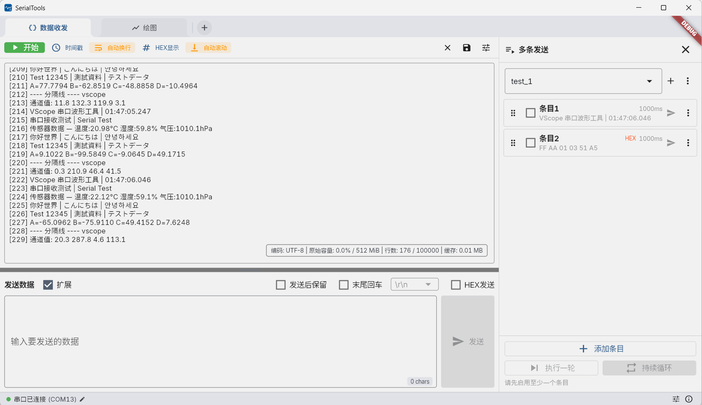
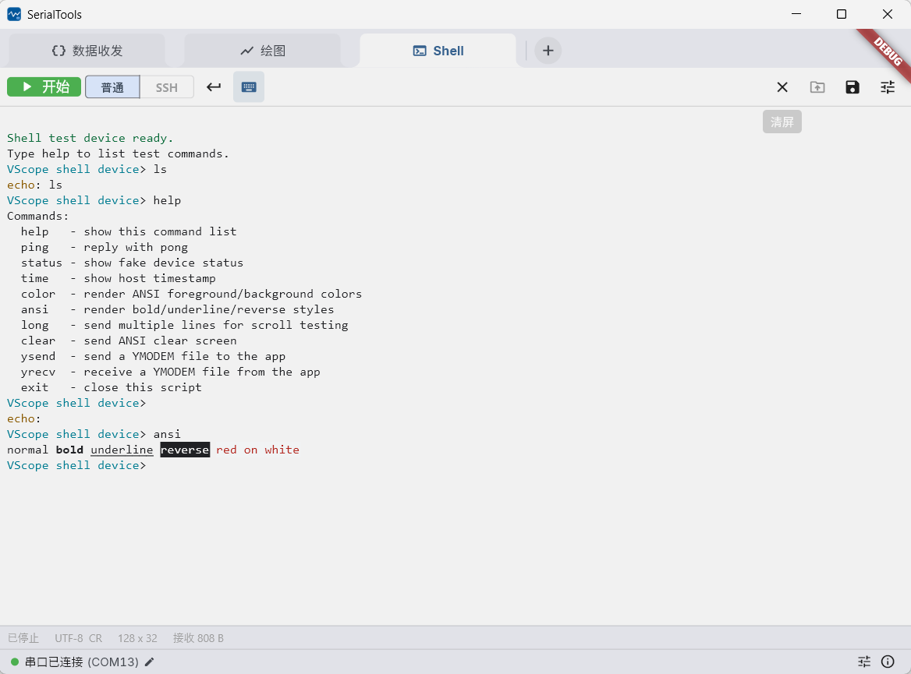
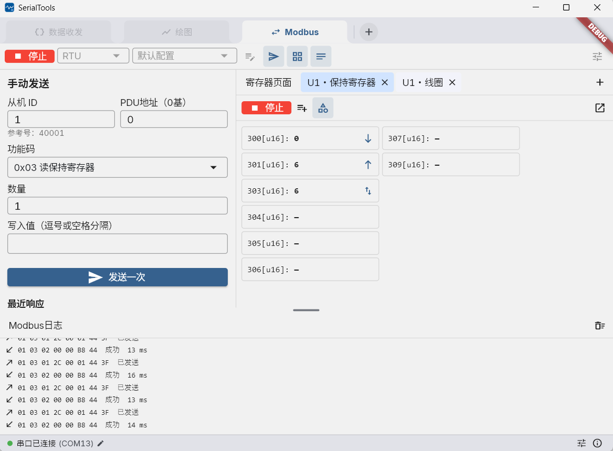
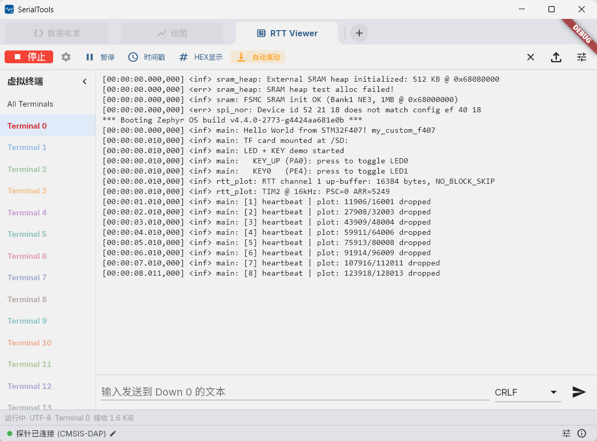
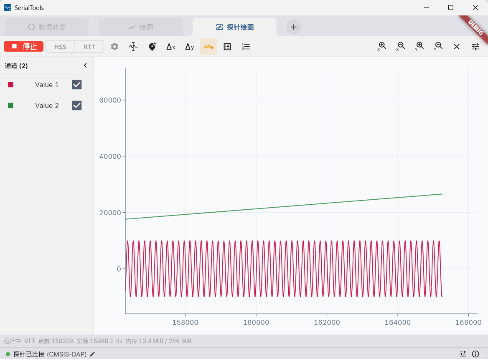
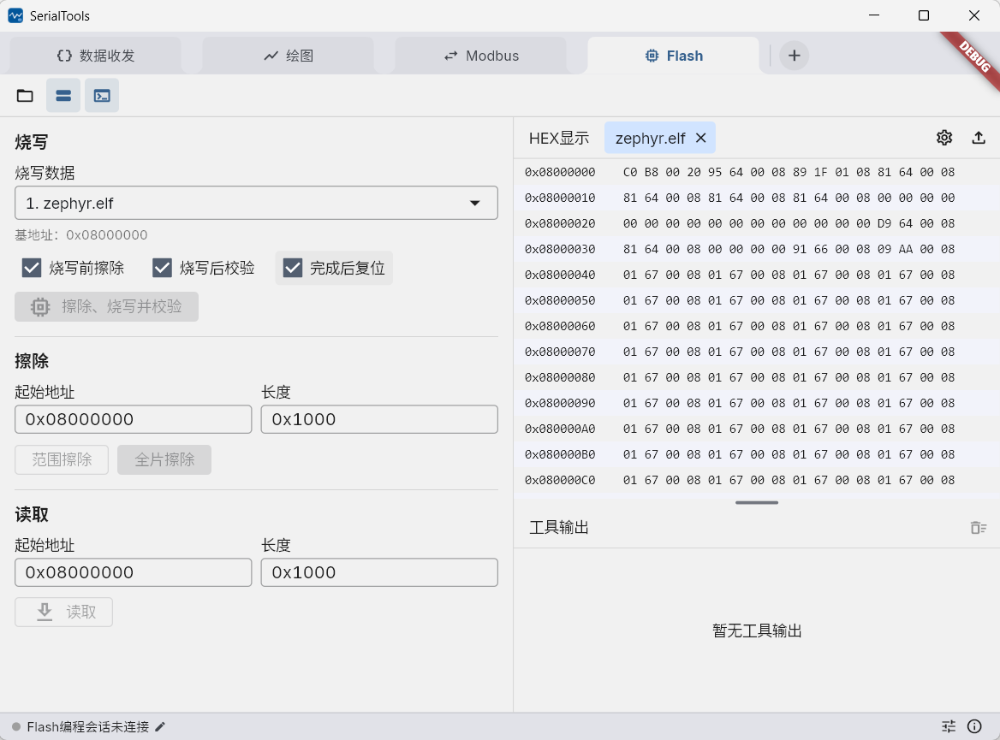

# SerialTools

SerialTools 是面向 Windows 的嵌入式综合工具，覆盖设备通信、协议调试、实时绘图、终端交互、Modbus 主站、RTT 监控、运行态变量观测和 Flash 编程。

## 功能汇总

| 功能 | 简述 |
| --- | --- |
| [数据收发](#数据收发) | 通过串口、TCP 客户端、单客户端 TCP 服务端或固定远端 UDP 收发文本与 HEX 数据，支持多编码、时间戳、自动换行、多条发送和数据导出。 |
| [绘图](#绘图) | 从串口、TCP 客户端或 UDP 接收协议数据并实时绘图，提供普通/数学通道、触发、观察、测量、统计、缩放、跟随和大数据 LOD。 |
| [Shell](#shell) | 提供串口/TCP 终端和独立 SSH 终端，支持 ANSI、命令行/逐键输入、命令历史和文本导出，并附带串口 YMODEM 文件传输。 |
| [Modbus 主站](#modbus-主站) | 支持 RTU、ASCII 和 TCP，提供手动读写、周期轮询、周期发送、寄存器页面、配置库、原始帧日志和独立寄存器窗口。 |
| [RTT Viewer](#rtt-viewer) | 通过 J-Link、OpenOCD 或 pyOCD 访问 SEGGER RTT，查看虚拟终端 0～15、All Terminals，并通过 RTT Down 0 发送数据。 |
| [探针绘图](#探针绘图) | 通过 RTT Up 或运行态 HSS 采集数据，支持 J-Scope 格式和 ELF/AXF/OUT 符号变量选择，复用完整的绘图与测量能力。 |
| [Flash 编程](#flash-编程) | 使用独立高权限探针会话完成 ELF/HEX/BIN 烧写、校验、全片/范围擦除和内存读取，支持外部 J-Link、外置及内置 OpenOCD。 |
| [应用管理](#共用能力) | 支持页面动态添加与排序、按页面保存连接配置、稳定版/Beta 更新、版本回退和诊断日志。 |

## 下载与启动

1. 从 [GitHub Releases](https://github.com/ZhiJuan0724/vscope_serial/releases) 或 [Gitee Releases](https://gitee.com/ZhiJuan0724/vscope_serial/releases) 下载 Windows ZIP。
2. 完整解压到可写目录，不要直接在压缩包中运行。
3. 启动 `vscope_serial.exe`。

支持 Windows 10/11 x64。设置、配置、日志、导出和更新文件保存在程序目录，因此不建议安装到无写入权限的位置。应用默认显示“数据收发”和“绘图”，其他页面可通过主标签末尾的“+”按需添加。

## 页面与功能

### 数据收发

数据收发用于观察设备原始通信和快速构造测试数据：

- 支持串口、TCP 客户端、单客户端 TCP 服务端和固定远端 UDP。
- 支持文本/HEX 显示与发送、时间戳、自动换行、行尾和 UTF-8、GBK、BIG5、Shift_JIS、EUC-KR 等编码。
- 多条发送支持独立配置、循环发送和配置文件管理；接收结果可导出为文本或 BIN。
- 显示行数只限制界面缓存；完整原始字节记录上限为 `512 MiB`，达到上限后停止接收并保留已有数据。

点击窗口左下角的连接状态区域可配置连接参数。网络入口需要先在应用高级设置中启用。

### 绘图

绘图页面用于把设备协议数据转换为可交互波形：

- 支持串口、TCP 客户端和 UDP 数据源，以及 FireWater、固定帧、Zobow、JustFloat 等接收协议和独立发送协议。
- 提供最多 16 个普通通道和 4 个数学通道，可配置名称、颜色、数据类型、缩放、偏置和绑定偏置轴。
- 支持触发、垂直光标、观察、Delta X/Y、区间统计、图例、实时值、跟随、局部框选和 X/Y 自适应。
- 支持 CSV、BIN、旧版 DAT 导入及 CSV/BIN 导出；大范围数据使用性能优先、均衡或质量优先 LOD 绘制。
- 历史内存预算可设为 `1~8 GiB`；达到预算后停止采集，并保留已有历史和导出能力。

| 操作 | 效果 |
| --- | --- |
| 滚轮或触控板捏合 | 缩放 X 轴 |
| `Shift + 滚轮` | 缩放 Y 轴 |
| 鼠标或触控板拖动 | 平移视口 |
| `Shift + 左键拖动` | 根据拖动方向缩放 X 或 Y |
| 框选按钮左键 | 启用蓝色单次框选，放大后自动关闭 |
| 框选按钮右键 | 启用橙色连续框选，需要手动关闭 |
| 框选期间右键拖动 | 平移视口 |
| 通道右键 | 打开通道、偏置和数学通道操作 |

绘图期间会锁定协议、配置和导入导出。启用“保持绘图”后，仅相同协议且通道数一致的新数据流可以续接历史。

### Shell

Shell 页面用于交互式终端和文件传输：

- 普通模式支持串口或 TCP 客户端，SSH 模式支持密码/PEM 私钥认证、主机指纹确认和 PTY 终端。
- 支持 ANSI、命令行/逐键输入、本地回显、独立编码与行尾、命令历史、终端主题和文本导出。
- 右键在有选择时复制文本，无选择时粘贴；`Ctrl+C` 在终端中发送 ETX。
- YMODEM 发送和接收仅用于串口，接收文件默认保存到 `<程序目录>/exports/ymodem/`。

### Modbus 主站

Modbus 页面用于集中管理寄存器读写和周期任务：

- 支持 Modbus RTU、ASCII 和 TCP，以及常用线圈、离散输入、输入寄存器和保持寄存器功能码。
- 支持单次读写、轮询查询和周期发送；周期最小为 `10 ms`，写入数据可固定、随机、自增或自减。
- 地址使用 0 基 PDU 地址，并同步显示常见的 00001/10001/30001/40001 参考号。
- 寄存器可配置变量类型、备注、背景色和查询/发送方向标识；多字节值支持全局字节序、字序及排列预览。
- 配置自动保存到 `<程序目录>/config/modbus/`，支持切换、新建、重命名、删除、导入和导出，并始终保留空白“默认配置”。
- 寄存器页面可打开独立窗口；主窗口负责连接和调度，独立窗口与主页面共享配置与实时状态。
- 日志区域记录每次查询、写入、响应和原始帧，可在全局设置中限制保留行数。

### RTT Viewer

RTT Viewer 用于不经过串口观察目标设备的 SEGGER RTT 通道：

- 支持虚拟终端 0～15、All Terminals 汇总、RTT Down 0 发送、暂停、时间戳、文本/HEX 和导出。
- 支持外部 J-Link、外置 OpenOCD、随发布包提供的内置 OpenOCD，以及用户 Python 环境中的 pyOCD `0.45.x`。
- RTT 控制块支持自动检测、指定地址或指定范围；终端可单独设置名称和颜色。

### 探针绘图

探针绘图用于在设备运行期间观察高速数据或内存变量：

- RTT 模式读取 RTT Up 通道并识别 J-Scope 格式；HSS 模式按地址周期采样变量。
- HSS 可从 ELF、AXF 或 OUT 文件搜索和选择符号，避免手工录入变量地址。
- 提供与普通绘图一致的通道、观察、Delta X/Y、跟随、图例、实时值、缩放和绘图质量设置。
- 监控路径严格非侵入，不执行停核、复位、恢复、烧录、擦除或核心调试操作。

### Flash 编程

Flash 页面用于执行会改变目标设备状态的高权限操作：

- 支持外部 J-Link、外置 OpenOCD 和内置 OpenOCD；自动模式只在连接前选择后端。
- 支持 ELF、HEX、BIN 烧写与校验，BIN 需要指定基地址；可选择完成后复位运行或保持停止。
- 支持全片擦除、地址范围擦除，以及按地址和长度读取内存为 BIN。
- HEX 文件可在多标签查看器中浏览和导出，操作日志与数据区域可分别调整高度。
- 编程会话独占全局探针连接；操作期间禁止普通断开、切页、关闭页面和退出。

Flash 编程与 RTT Viewer、探针绘图的非侵入式监控会话完全分离。强制终止编程不会自动发送 reset 或 resume，目标状态会标记为未知。

## 绘图协议

| 协议 | 格式或用途 |
| --- | --- |
| FireWater | 逗号分隔的 ASCII 数值。 |
| 固定帧 | 自定义帧头、帧尾和通道类型；数据字段固定小端，校验和字节序可配置，并支持 CRC。 |
| Zobow | 4/8 通道固定帧，使用 CRC16/MODBUS。 |
| JustFloat | 小端 `float32` 数组及固定帧尾。 |
| r 协议 | 向设备发送通道地址的文本命令。 |

固定帧、Zobow 和 r 协议可在对应设置中配置。地址配置支持 JSON/CSV 导入导出，Zobow 还支持从 C 代码识别。

## 共用能力

- 主页面支持动态添加、右键关闭和拖动排序；活动连接或操作会锁定不兼容的页面切换和关闭行为。
- 数据收发、Shell、绘图和 Modbus 共用连接所有权，可按页面独立保存串口参数。
- 应用高级设置集中管理页面入口、网络功能、内存限制、诊断日志和连接快捷键。
- 应用信息页支持稳定版/Beta 更新通道、更新源、SHA-256 校验和本地版本回退。
- 设置窗口采用草稿编辑，保存时一次提交；存在未保存修改时会提示保存、放弃或取消。

## 数据目录

| 目录 | 内容 |
| --- | --- |
| `settings/` | 应用设置。 |
| `config/` | 协议、通道、多条发送和 Modbus 配置。 |
| `logs/` | 运行日志。 |
| `exports/` | 数据、终端文本和 YMODEM 文件。 |
| `updates/` | 更新缓存和回退版本。 |

“恢复默认设置”不会删除 `config/` 中的用户配置。

## 开发与许可

开发环境、测试、构建和发布见 [DEVELOPMENT.md](DEVELOPMENT.md)，长期架构约束见 [docs/CONTEXT.md](docs/CONTEXT.md)。

本项目使用 [MIT License](LICENSE)。
